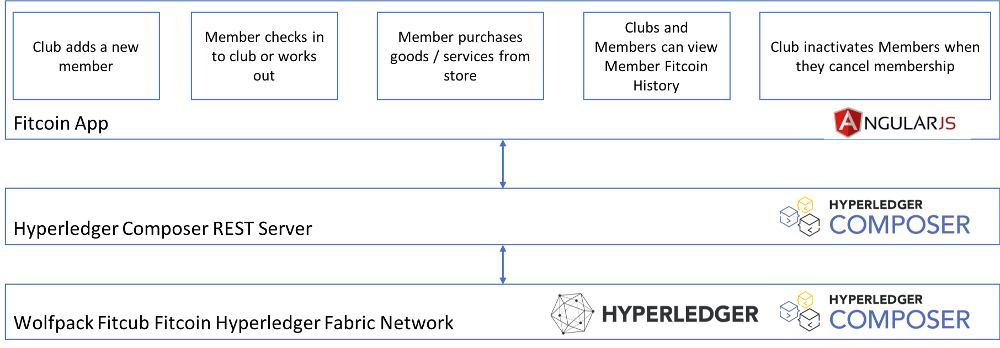

# The Fitcoin project

This is a sample web application that uses a Hyperledger Fabric blockchain to track and trace fitness rewards. 

One of the biggest challenges Fitness Clubs face is maintaining members. It is always cheaper to keep a member than attract new members. To retain members, some clubs will offer loyalty programs, but oftentimes, those are ineffective because they may provide future free months or potentially offer a discount to friends and family. Sometimes, the program only rewards members when they refer friends to the club.

In order to make loyalty more effective, there are a few things that will improve the programs:

1. Rewards for working out incentivizes members to use the facilities
2. Ability to use their rewards more frequently and for more valuable purchases
3. Visibility into their rewards lends trust to the program

With Fitcoins, we even add a new feature to loyalty programs, community building. By bringing local merchants into the program, we can facilitate commerce with those merchants that want to be affiliated with the club loyalty program. This provides an easy way for members to transact with the stores using digital currency. The store owners benefit by getting access to customers they may not have had. As the store owners earn Fitcoins through purchases, those Fitcoins could potentially be exchanged for cash from the club or used to maybe purchase advertising at the club. This creates a whole ecosystem around the club and a sense of community.

With the Fitcoin app, a Fitness Club can add new members. For active members, you can simulate those members receiving rewards points, redeeming rewards points, and viewing their rewards points history. Clubs can also inactivate members to simulate members cancelling their memberships, something we hope never happens.

## Fitcoin architecture
---


### Install the components
---
1. Verify the pre-requisites below for MacOS and Linux
1. [Install Hyperledger Fabric and Composer](./fabric-dev-servers/README.md)
2. [Build and deploy the Fitcoin Blockchain Network](./wolfpack-fitclub-fitcoin/README.md)
3. [Build and run the Fitcoin Angular Web App](./fitcoin-app/README.md)

## Main components
---
1. Hyperledger Fabric and Hyperledger Composer
2. Fitcoin Blockchain Network Archive
3. Fitcoin Angular Web App

## Pre-requisites
---
1. At least 4Gb of memory
2. Operating Systems: Ubuntu Linux 14.04 / 16.04 LTS (both 64-bit), or Mac OS 10.12
3. Docker Engine: Version 17.03 or higher
4. Docker-Compose: Version 1.8 or higher
5. Node: 8.9 or higher (note version 9 is not supported)
6. npm: v5.x
7. git: 2.9.x or higher
8. Python: 2.7.x

## Installing pre-requisites on Ubuntu

1. Login as a normal user, rather than root.
2. Do not su to root.
3. When installing prerequisites, use curl, then unzip using sudo.
4. Run prereqs-ubuntu.sh as a normal user. It may prompt for root password as some of it's actions are required to be run as root.
5. Do not use npm with sudo or su to root to use it.
6. Avoid installing node globally as root.

If you're running on Ubuntu, you can download the prerequisites using the following commands:

```
curl -O https://hyperledger.github.io/composer/latest/prereqs-ubuntu.sh

chmod u+x prereqs-ubuntu.sh
```

Next run the script - as this briefly uses sudo during its execution, you will be prompted for your password.

```
./prereqs-ubuntu.sh
```

## Installing pre-requisites on MacOS
---

**Note: Mac OS X version 10.12.6 was used for these instructions.**

### Install nvm and Apple Xcode 
---

First install nvm (the Node version manager). nvm is a tool that allows you to easily install, update and switch between versions of Node.js.

Open the terminal (command line) by clicking on the magnifier in the menu bar at the top right of your screen. Type terminal and press enter.

In the terminal window paste the text below and press enter:

```
curl -o- https://raw.githubusercontent.com/creationix/nvm/v0.33.0/install.sh | bash
```

More information on this script and the Node install process is available here.

When you hit enter you should see the pop-up below, prompting you to install git. Press the Get Xcode button to install the full Apple Xcode IDE, including a C++ compiler, used to install native Node.js modules.

The download and install process for Xcode may take 20 minutes or more. Be patient!

After the installation of Xcode has completed launch Xcode. Accept the license agreement. It will prompt you for your username and password and will install additional components.

After Xcode finishes installing additional components and launches, simply quit Xcode.

Switch back to the terminal and create your bash profile (stores user preferences for bash):

```
touch .bash_profile
```

Then rerun the original curl command:

```
curl -o- https://raw.githubusercontent.com/creationix/nvm/v0.33.0/install.sh | bash
```

Close the terminal and reopen it.

Check that nvm is installed and is accessible:

```
nvm —-version
```

### Install Node
---
Install the latest (long term support) version of Node:
```
nvm install --lts
```
Switch to the LTS version of Node:
```
nvm use --lts
```
Check that Node is installed:
```
node --version
```

### Install Docker
---
Follow the instructions here to install Docker for Mac (stable): https://docs.docker.com/docker-for-mac/install/

After running the installed Docker application you should have the whale icon in your menu bar, with a green “Docker is running” status.


