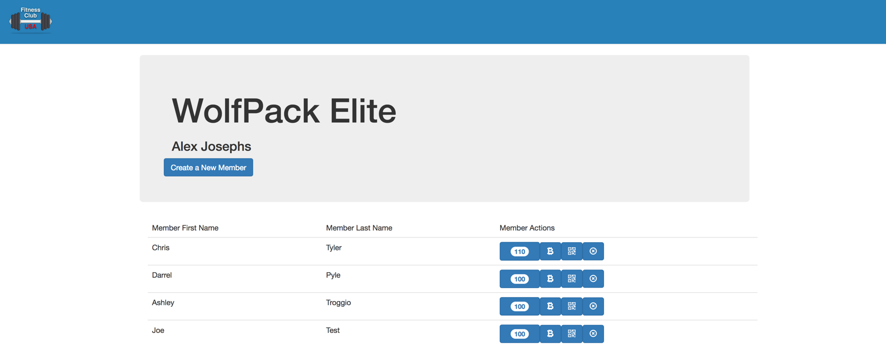
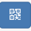
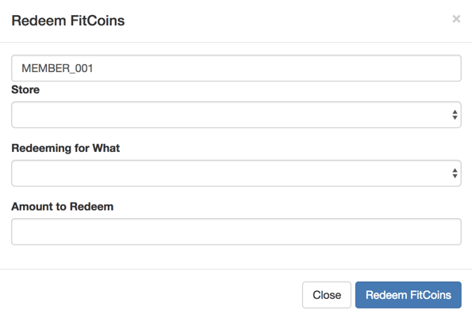
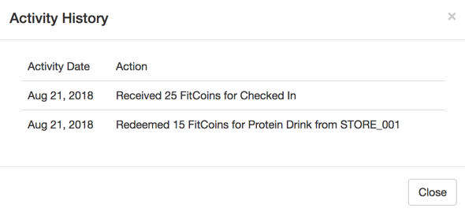

# The Fitcoin Angular Web App

The users will interact with the blockchain through a web UI written using Node.js and Angular 2 (6.x) framework.



## Install the web app

From the ./fitcoin-app directory, enter the following command to have all the components installed locally.

```
npm install
```

This will take a few minutes

## Run the web app

Ensure that you have started your Composer REST Server and that you have run the SetupDemo transaction to load data. Enter the following command to start the web app.

```
npm start
```

This will start the web app on http://localhost:3000. You can launch a web browser and go to the app.

## Access the Fitcoin application

Open a web browser and go to http://localhost:3000. You should see the following page. Here is where you can simulate a variety of activities that might occur around club membership.


From this application, you can do several things:
1. Add new members to my fitness club (new members are seeded with 100 Fitcoins)
2. Members can acquire more Fitcoins
3. Members can redeem their Fitcoins at Stores affiliated with the Club
4. Members can view their Fitcoin history
5. Clubs can inactivate members

### Adding new members
---

Under the Club name and Club owner name (Alex Josephs), you can click the **Create a New Member** button.


Enter the member's First and Last name and click Add Member

### Receiving Fitcoins
----

Back on the main page, you can click on the  icon to add 25 Fitcoins to the member's wallet. This could simulate a number of things:

- KeyFOB swipe to enter the club
- Member running on the treadmill
- Member referring a friend

### Redeeming Fitcoins
---
Again, on the main page, you can click on the  icon to transact Fitcoins from the Member to a Store. You will see the Redeem Fitcoins form.   Here you can use the drop down to pick the Store, pick the item to redeem for and enter how many Fitcoins to redeem. Click the Redeem Fitcoins button.

At this point, the Fitcoins are moved from the Member's Wallet to the Store Owner's Wallet

### Viewing activity detail
---
You may need to refresh the screen. You can click the button that shows the current Fitcoin balance. 

This will open a list of all of the Fitcoin transactions.


### Inactivate members
--- 
As members leave the club, they can be inactivated. By clickcing on the Inactivate Member button, you will inactivate the current member and they will be removed from the list of members. 

